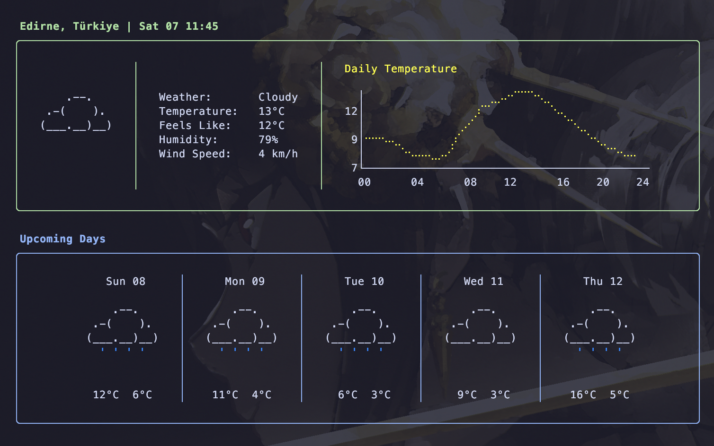

# clawea

A terminal based weather forecast application written in Go using [Bubble Tea](https://github.com/charmbracelet/bubbletea) and [Lipgloss](https://github.com/charmbracelet/lipgloss)



## Installation

```bash
go install github.com/cladamos/clawea@latest
```

If the command isn't recognized after installation, ensure your Go bin folder is in your PATH

## Usage

Simply run the command to see the forecast for your current location:

```bash
clawea
```

### Controls

- `q` or `ctrl+c`: Quit the application
- `l` or `→`: Next Page
- `h` or `←`: Previous Page

## APIs Used

- I used [Open-Meteo](https://open-meteo.com/) for all weather data in the application.
- I used [ip-api](https://ip-api.com/) to find the user's location.
